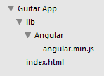
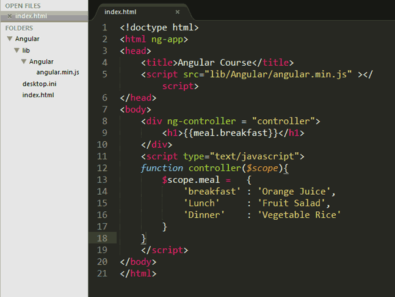
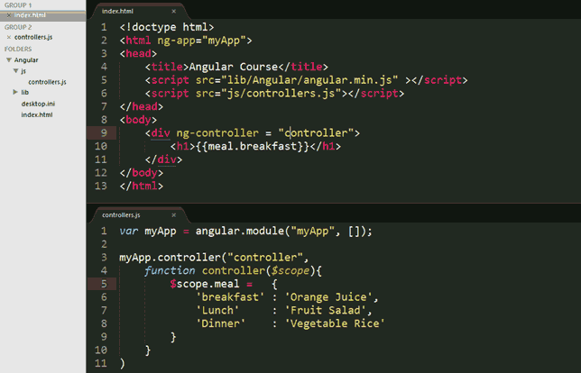

# Panduan Lengkap AngularJS
**Y.N. Pamungkas Jayuda** *@2014 ThinkBuntu*
## Pendahuluan

Selamat datang di AngularJS Tutorial. AngularJS adalah aplikasi client-side javascript framework. AngularJS biasanya dipakai oleh programer yang menguasai javascript dengan baik. Ada banyak tutorial mengenai AngularJS, jadi dalam tutorial ini saya akan berusaha menyajikan secara sederhana dan mendasar pada AngularJS. Misalkan kita akan belajar AngularJS untuk membuat satu halaman aplikasi sederhana. Selain itu saya juga menuliskan source code dengan lengkap, atau Anda bisa download di Github saya. Adapun pembahasan kita yaitu :

1. Pendahuluan
2. Membuat Aplikasi Sederhana
3. MVC Architecture 
4. Modules di AngularJS
5. Kompleks Models di AngularJS
6. Membaca JSON di AngularJS
7. Filter data
8. Data Binding
9. Routing
10. Route Parameter
11. Navigasi
12. Animasi
13. Tabs
14. Form Validasi
15. Custom Directive.

Tutorial ini akan memjawab pertanyaan berikut :
1. Apa yang tercover dalam tutorial ini ?  
	Kita akan belajar bagaimana AngularJS bisa digunakan untuk membuat aplikasi dengan sederhana, cepat dan efisien. Kita akan membuat aplikasi AngularJS secara lengkap dan utuh. Kita akan banyak berbicara mengenai konsep MVC. Selain itu dibahas juga bagaimana kita bekerja dengan module  dan AngularJS service (http, routes, provider dan animasi). 
2. Apa yang perlu diketahui sebelum belajar AngularJS ?  
	Anda harus familier dan sudah mengenal HTML, Javascript dan perbedaan antara JS dan JSON. AngularJS bukan untuk pemula, karena AngularJS merupakan javascript tingkat atas. Untuk bekerja dengan AngularJS baiknya Anda mempunyai text-editor seperti Notepad, Sublime Text Editor.
3. Apa itu AngularJS APP ?  
	AngularJS adalah javascript framework untuk membuat SINGLE PAGE WEB APPLICATION, jadi hanya 1 page aja kawan. Aplikasi Anda akan lebih cepat, karena website Anda hanya akan mengambil atau load data content yang diperlukan saja.  
	 
4. Kenapa harus AngularJS framework ?
	1. Lebih cepat coding dengan AngularJS
		2. AngularJS tidak tertutup, jadi Anda bisa memakai javascript lain bersamaan dengan AngularJS.
		3. Terdapat fungsi AJAX di AngularJS untuk load data ( Database, text, etc). Selain itu AngularJS sangat mudah menghandle JSON data. 
		4. AngularJS menggunakan arsitektur MVC.
5. Apa feature dasar dari AngularJS ?
	1. directive 
		2. data-binding
		3. filters
		4. modules
		5. routes
		6. controllers  

Ok, itu yang akan di pelajari dalam tutorial ini. Jika ada yang kurang jangan sungkan - sungkan untuk memberitahukan ke saya via email di *yulius.jayuda@gmail.com*
## Membuat Aplikasi Sederhana
Dalam bab ini kita akan belajar hal paling dasar dari AngularJS.  Jika Anda belum mengerti mengenai AngularJS silahkan baca di *Pendahuluan*. Berikut langkah-langkah awal mengenai AngularJS :
1. Download AngularJS  
	Pastikan anda mendownload versi terbaru dan Angular.min.js harus ada di dalamnya.
2. Buat folder dengan nama Guitar App.
3. Masuk ke dalam folder Guitar App, lalu buat folder baru dengan nama lib.
4. Masuk ke folder lib tersebut, lalu buat folder baru dengan nama Angular.
5. Copy Paste file Angular.min.js ke folder Angular tersebut (lihat tahap 4).
6. Buat file index.html di dalam folder Guitar App (lihat tahap 2) dan tuliskan baris coding berikut ini :   
	`<!doctype html>`  
	`<html ng-app>`  
	`<head>`  
	`<meta charset="UTF-8">`  
	`<title>Guitar App</title>`  
	``  
	`</head>`  
	`<body>`  
	`<input type="text" ng-model="name">`  
	`<h2> Welcome {{name}} </h2>`  
	`</body>`  
	`</html>`
7. Pastikan struktur folder Anda seperti berikut :
	
8. Selesai, untuk mencoba silahkan buka dari browser. Kalo gagal, pastikan coding Anda benar dan Folder Guitar App berada di folder webserver.

*Penjelasan Syntax Program*
Ok,.. Sekarang akan saya jelaskan apa maksud dari coding diatas, penjelasan lebih detail ada di Bagian 6. 
1. ng-app  
	Syntacs inilah yang memberitahukan ke browser bahwa coding dijalankan. Semacam triger ke javascript yang mangacu dari ng-app ini.
2. ng-model :   
	Ini ada lah control ke model. Jadi misal kita punya object input, select, atau textarea maka data dari object itu di binding ke variable. Misalkan nama dari textbox "NIP" maka dibinding ke `{{sNIP}}`. Penamaan tersebut terserah Anda, biasanya saya memberikan penamaan diawali dengan karakter huruf kecil yang menandakan tipe data dari variable tersebut. Misalkan sNIP maka tipe data String untuk variable NIP. Lebih mudah kan,.. IMHO :)
Dua syntax tersebut berasal dari AngularJS, untuk syntax lainnya itu HTML kawan. 

### Kembangkan Kreatifitas Anda
Jadi, dari coding sederhana diatas kita membuat textbox dimana setiap text yang kita tuliskan akan muncul dibawahnya. Anda bisa mengembahkan dengan operasi penjumlahan misalkan `{{1+nama}}`, etc. 

## MVC Architecture 
Dari struktur, AngularJS cukup berbeda dengan Javascript biasa. Salah satu struktur arsitek bahasa pemrograman yang terkenal yaitu MVC bisa di terapkan di AngularJS ini. MVC adalah struktur yang membagi object menjadi *model*, *view*, *controller*. Mari kita lihat seperti apa MVC di AngularJS.

Sebelum memulai AngularJS, Anda harus membaca bagian I : *Membuat Aplikasi Sederhana dg AngularJS*. Karena dalam bagian tersebut dijelaskan hal paling mendasar dari AngularJS.

### Model
Mudahnya, Model bisa dianggap sebagai DATA. Jadi data bisa diambil dari database, atau hardcode langsung atau dari JSON, etc. Biar anda bisa memahami hal tersebut, berikut contoh model :

``

*Penjelasan Syntax :*
*$scope* adalah object dan *meal* adalah variable yang ditambahkan di $scope. Data yang disajikan berupa array jadi termasuk JSON.

### View
View berfungsi untuk menampilkan data dari model. Syntax yang dipakai untuk view adalah tanda kurung kurawal sebanyak 2 kali. Misalkan seperti ini :
`{{meal.breakfast}}`

*Penjalasan Syntax :*
View mengambil data dari variabel *meal*, dengan mengambil data JSON untuk breakfast.

### Controller
Controller berfungsi untuk mengontrol **model** melalui tampilan yang dihasilkan **view**. Contoh syntax dari controller misalkan seperti ini :
` function food($scope) `
``
``
` }`

dengan view seperti berikut :
` 
 
`

*Penjalasan Syntax :*
Controller yang di tampilkan di view tersebut akan memanggil/mentriger function food.

Sehingga hasil akhir dari coding MVC tersebut seperti berikut :

## Module di AngularJS
Sejauh ini kita sudah membuat aplikasi sederhana dengan AngularJS. Aplikasi yang baru saja kita bangun itu sangat kuno dan tidak praktis, karena semua coding berada pada satu halaman yang sama. Hal ini akan sangat menyulitkan jika kita ketemu dengan aplikasi yang cukup besar. Jadi akan lebih baik kita mengorganisasi semua code tersebut ke dalam module. Ingat module ada bukan hanya di AngularJS. Karena hampir setiap bahasa pemrograman terutama javascript terdapat module.

Module merupakan salah satu cara untuk mengorganisir code berdasar fungsi. Coding yang berfungsi sama dikelompokkan menjadi satu. Berikut salah satu tampilan dari module :

`Angular.module(“Guitar”, []);`

Dari controller pada bagian sebelumnya, Lakukan langkah-langkah berikut :
1. Buat folder js
2. buat file controllers.js
3. Cut model dan controller dari index.html
4. Paste ke controller.js  
	sehingga anda mempunyai file js/controllers.js dengan tampilan seperti berikut ini :  
	")
5. Tambahkan baris code berikut sebelum function controller diatas.  
	`var myApp = angular.module("myApp", []);'
	 myApp.controller("controller",`
6. Sehingga tampilan menjadi :
	 
## Kompleks Models di AngularJS
Sejauh ini kita sudah berhasil membuat aplikasi sederhana dengan AngularJS. Lebih lanjut kita akan membuat MVC yang lebih kompleks. Kompleks disini berarti kita membagi project ke dalam beberapa JSON. tapi untuk tahap ini kita cukup memakai satu JSON saja. Tutorial pada bab ini akan berkaitan dengan bagian berikutnya. Ok,.. mari kita mulai, supaya penasaran Anda terobati. Kita akan mendapatkan data ( JSON ) dari controllers.js dan menampilkan data tersebut melalui looping.

Ok,... Dari project sebelumnya, sekarang anda ubah index.html dengan code berikut :

Sedangkan untuk controllers.js anda tambahkan code item menjadi seperti ini :

*Penjelasan Syntax*
1. ng-app="myApp"  
	Syntax tersebut digunakan untuk deklarasi html untuk load module myApp di controllers.js
2. ng-controller="controller"  
	Bagian inilah sebagai baris code yang menjembatani model dengan view
3. ng-repeat="item in meal"  
	*item* adalah referensi untuk variabel di controllers.js dan *ng-repeat* berfungsi sebagai loop atau perulangan dari JSON mulai dari item pertama sampai item terakhir.
4. {{item.name}} mengambil item dengan kategori 'name' dari variable *meal*.

Bagaimana tidak banyak perubahan kan ? Pada tahap ini kita belajar bagaimana looping di view untuk menampilkan data list items dari model. Hasil dari coding tersebut diatas akan seperti ini :

Setelah Anda memplajari looping tersebut, bagaimana cukup mudah kan ? maka yang tak kalah penting adalah bagaimana membaca data dari JSON. Baca bab berikutnya :)
### Membaca JSON di AngularJS
Kita dapat membaca data eksternal dengan AngularJS. Dari latihan pertama sampai bab looping data, kita menuliskan data di variable *meal* yang ditulis secara hardcode. Anda mungkin berpikir, bagaimana membaca data dari luar sehingga dalam mengatur data akan lebih mudah. Pada tehnik tradisional javascript anda mengambil data menggunakan XHR request dari JSON, atau sering disebut dengan AJAX. 
Di AngularJS kita bisa membaca data eksternal dengan tehnologi yang disebut sebagai *AngularJS Service* atau http service di AngularJS. AngularJS service tidak lebih dari cara membaca data dari suatu file. Dalam hal ini kita akan membaca data di http service di server.

Di tutorial sebelumnya anda memiliki controllers.js, dimana data dituliskan langsung di variabel meal. Di controllers.js tersebut Anda ubah dengan mengambil data dari file JSON. sehingga tampilan code menjadi seperti berikut.

